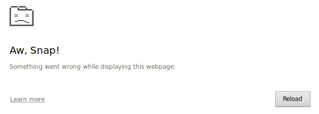

# Ratel JavaScript SDK
Building:

```
npm install
npm run build
```

Running:

```
npm start
```

Test environment:

```
npm test
npm run test-dev
```

## 307 response:
When run locally, SDK will connect with ratel & artichoke via `http` protocol.
 This causes HSTS problem.
 To hack this in Chrome (http://stackoverflow.com/questions/34108241/non-authoritative-reason-header-field-http):
 - open chrome://net-internals/#hsts
 - delete domains: 'api.dev.ratel.io' and 'artichoke.ratel.io'
 - enjoy


# Changelog
The format is based on [Keep a Changelog](http://keepachangelog.com/en/1.0.0/)

## 0.5.0
### Added
- `Message` class now has `tag` and optional `context` fields (plain text messages have `tag` set to `TEXT_MESSAGE` and no context).
- `Room` now has `onCustom(tag, callback)`, `sendCustom(body, tag, context)` methods used to send/receive custom messages.

### Changed
- `Room`/`Call` actions are now instances of `Message` class with appropriate `tag` value (`ROOM_JOINED`, `CALL_TRANSFERRED`, etc).
- Actions store context data in `context` field (`message.context.invitee` for invitations and `message.context.reason` for leaves).
- Old `Room`/`Call` callbacks (`onJoined()`, `onLeft()`, etc) still work correctly althoug they now pass a `Message` instance to the callback.

### Removed
- There are no `Media` nor `Metadata` clasess any longer.
- There are no `CallAction`, `RoomAction` events any longer.
- `Room` now doesn't have `onMedia()`, `onMetadata()`, `sendMedia()` nor `sendMetadata()`.

## 0.4.12
### Changed
- `RoomCreated` event has now rich Room object
